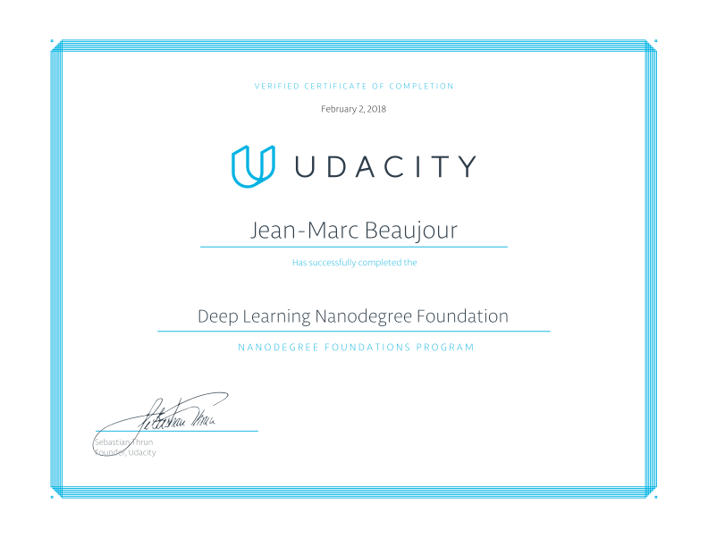
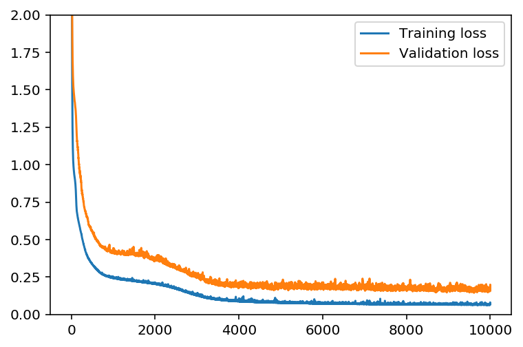
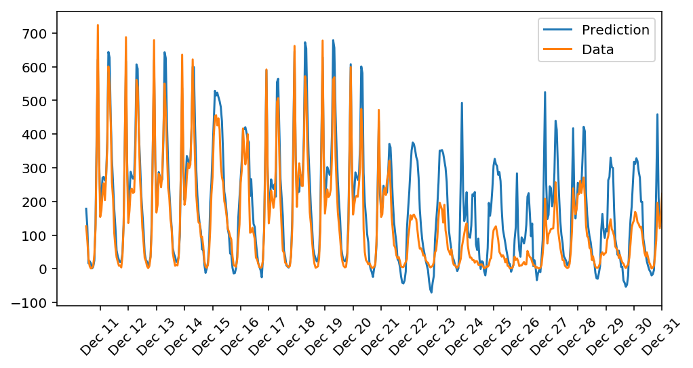
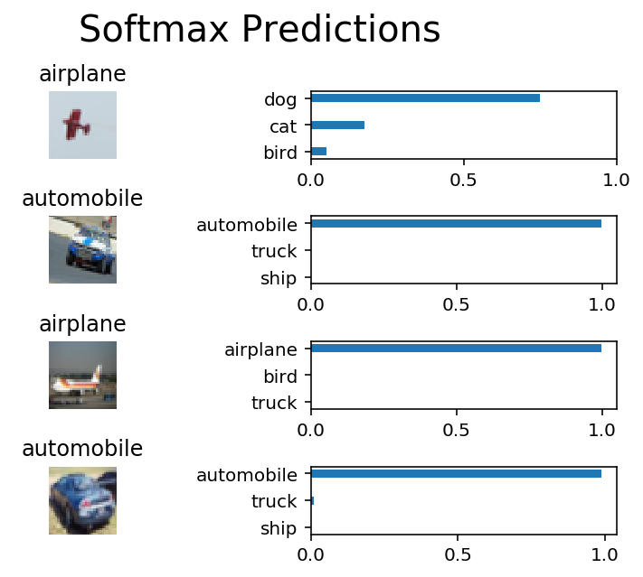
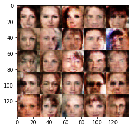

# Deep Learning Foundation Nanodegree (Udacity)

My projects submitted for the DLFND.
The purpose of this project is not to produce as optimized and computationally efficient algorithms as possible but rather to present the inner workings of them in a transparent and accessible way.

<table style="border=0px solid #000"><tr><td>

</td>
</tr>
<tr><td>**Certificate of Completion**</td></tr>
</table>


# Table of Contents
1. [First Neural Network](#First Neural Network)
2. [Image Classification with CNN](#Image Classification)
3. [TV Script Generation](#TV Script Generation)
4. [Language Translation](#Language Translation)
5. [Face Generation](#Face Generation)


--------------
## First Neural Network
In this project, I build a neural network using only numpy. That includes implementation of **gradient descent**, **backpropagation** from scratch. The NN model is made of a single hidden layer that uses the sigmoid activation function. The model is trained to predict the number of ride sharing of a bike rental shop!

**As an additional feature, I implemented **Gradient checking** to compare with the Gradient Descent from backpropagation.

```
N_i = train_features.shape[1]
network = NeuralNetwork(N_i, hidden_nodes, output_nodes, learning_rate)

losses = {'train':[], 'validation':[]}
batch = np.random.choice(train_features.index, size=128)
X, y = train_features.ix[batch].values, train_targets.ix[batch]['cnt']
network.gradient_checking(X, y)

>> Relative error Gradient Descent versus Numerical gradient 1.8604468910835457e-05
```

<table style="border=0px solid #000"><tr><td>


</td><td>

</td>
</tr>
<tr><td>**Learning curve**</td><td>**Prediction**
</td></tr>
</table>

--------------
## Image Classification
Introduction
The goal of the project is to classify images from a subset of the CIFAR-10 dataset. The dataset consists of airplanes, dogs, cats, and other objects. The images are preprocessed (normalization of pixel intensity), and the 10 labels are one-hot encoded .  A convolutional neural network is trained on dataset.


| ConvNet                       |
|-------------------------------|
|Input Shape: (None, 32, 32, 3) |


| Layer Type           | kernel size | stride  |Number of kernel| Number of units |
|----------------------|-------------|---------|----------------|-----------------|
| Conv2D               | (3, 3)      | (1, 1)  | 32             |                 |
| Activation (ReLU)    |             |         |                |                 |
| MaxPooling           | (2, 2)      | (2, 2)  |                |                 |
| Conv2D               | (3, 3)      | (1, 1)  |  64            |                 |
| Activation (ReLU)    |             |         |                |                 |
| MaxPooling           | (2, 2)      | (2, 2)  |                |                 |
| Conv2D               | (3, 3)      | (1, 1)  |  128           |                 |
| Activation (ReLU)    |             |         |                |                 |
| MaxPooling           | (2, 2)      | (2, 2)  |                |                 |
| Conv2D               | (3, 3)      | (1, 1)  |  256           |                 |
| Activation (ReLU)    |             |         |                |                 |
| MaxPooling           | (2, 2)      | (2, 2)  |                |                 |
| Flatten()            |             |         |                |                 |
| Dense                |             |         |                | 64              |
| Activation (ReLU)    |             |         |                |                 |
| Dense                |             |         |                | 10              |
| Activation (Softmax) |             |         |                |                 |


After 9 iterations:

| Training Loss | Validation Valid | Train. accuracy | Validation Accuracy |
|---------------|------------------|-----------------|---------------------|
| 0.23516       |      0.83927     |   1.0000        | 0.7196              |

<table style="border=0px solid #000"><tr><td>


</td><td>

</td>
</tr>
<tr><td>**Learning curve**</td><td>**Prediction**
</td></tr>
</table>

---
## TV Script Generation

The goal of this project is to generate Simpsons TV scripts using RNNs. The dataset is part of the Simpsons dataset of scripts from 27 seasons. 
The model generates a new TV script for a scene at Moe's Tavern.

The dataset is first pre-processed. 

1. A **Lookup Table** is built to transform the words to ids, and ids to words. In this function, create two dictionaries:
2. Tokenize Punctuation: Implement the function `token_lookup` to return a dict that will be used to tokenize symbols like "!" into "||Exclamation_Mark||". 

Results:

```
moe_szyslak:(scornful) bye weeks. bronco nagurski didn't get back to the latin grammys.
homer_simpson:(coming to) huh?...(points head)
moe_szyslak:(to self) oh, i can't say to the greatest.
homer_simpson: well, i was the wrong thing.
homer_simpson:(quiet) yeah, that broad! you was me!
c. _montgomery_burns:(reading)"..."
moe_szyslak: ahh., homer, you're right. you're way ahead in your drunkening.
homer_simpson:(dramatically) i want you to meet a frenchman, where you do?
moe_szyslak:(" duh") refreshingness over effervescence, moe. where's that waitress of yours?
professor_jonathan_frink: the trolls are us, moe.
moe_szyslak:(clears throat) and now, marge is a girl body a rat.
carl_carlson:(competitive) i can jump off the back.
lenny_leonard: ooh, i'm sorry. / moe! / etc.
moe_szyslak:(into phone) pleasure doing bart with me!
moe_szyslak:
```


## Language Translation
A sequence-to-sequence model is implemented to perform translation from English to French.
The sequence to sequence model is trained on a dataset of English and French sentences 
The components below are implemented in order to build the Sequence-to-Sequence model :

* model_inputs
* process_decoder_input
* encoding_layer
* decoding_layer_train
* decoding_layer_infer
* decoding_layer
* seq2seq_model


Some results:

```
Input
  Word Ids:      [149, 78, 153, 197, 129, 144, 181]
  English Words: ['he', 'saw', 'a', 'old', 'yellow', 'truck', '.']

Prediction
  Word Ids:      [162, 70, 174, 123, 268, 200, 313, 337, 1]
  French Words: il a vu un vieux camion jaune . <EOS>
```


## Face Generation

I implement generative adversarial networks to generate new images of faces.

<table style="border=0px solid #000"><tr><td>

</td></tr></table>


---

*Contact:*
Let me know if you have questions/suggestions. Feel free to connect with me on [LinkedIn](https://www.linkedin.com/in/jmlbeaujour/).